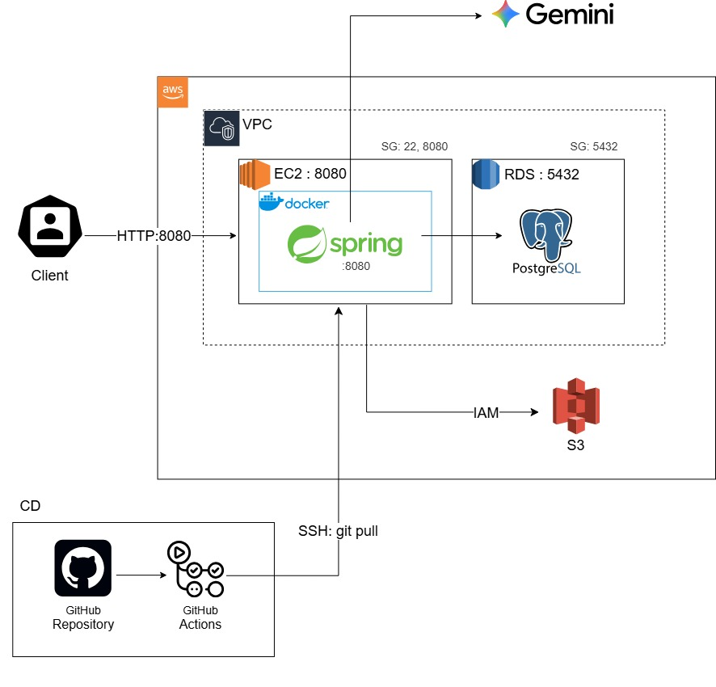

# 🚚 404-found-delivery — 배달 음식 주문 관리 플랫폼

 손님, 가게 사장님, 관리자가 각자의 권한으로 하나의 배달 서비스를 함께 운영하는 백엔드 API 서버를 만들었습니다.

---

## 📖 개요

광화문 지역 음식점을 대상으로, 주문·결제·리뷰 흐름 전체를 백엔드로 구현했습니다. 사용자는 회원가입 후 역할에 따라 CUSTOMER, OWNER, MANAGER, MASTER 네 가지로 나뉘며, 각 역할마다 접근 가능한 API와 데이터 범위가 다릅니다.

- 🙋 **손님**: 가게 탐색, 장바구니, 주문, 결제, 리뷰 작성
- 🏪 **사장님**: 가게/메뉴 등록 및 관리, 주문 접수 처리
- 🛡️ **관리자** (MANAGER, MASTER)
  - **매니저(MANAGER)** 는 가게 승인, 지역/카테고리 관리, 전체 데이터 조회 권한을 가지며
  - **마스터(MASTER)** 는 여기에 더해 매니저 계정을 생성·조회·수정·삭제할 수 있는 최종 관리자입니다.

---

## 👥 팀 구성

| 이름 | 담당 도메인 |
|---|---|
| 🔧 민지 | User, 공통(Global) — 인증/보안, 예외처리, 응답 포맷 |
| 🏬 서인 | Store, Category, Region |
| 🍜 초인 | Menu, AiRequest, Cart, CartItem |
| 📦 우현 | Order, OrderItem, Address |
| 💳 제희 | Payment, Review |

---

## 🛠 기술 스택

[](#)
[](#)
[](#)
[](#)
[](#)
[](#)
[](#)

| 영역 | 사용 기술 |
|---|---|
| 언어/프레임워크 | Java 17, Spring Boot 3 |
| 인증 | Spring Security, JWT (Stateless) |
| 데이터베이스 | PostgreSQL, Spring Data JPA (Hibernate 6) |
| 빌드 | Gradle |
| 문서화 | Swagger (springdoc-openapi) |
| 외부 연동 | Gemini API(메뉴 설명 생성), AWS S3(이미지 저장) |
| 기타 | Lombok |

---

## ✨ 기능 목록

| 도메인 | 내용 |
|---|---|
| 🔐 인증 | 회원가입(CUSTOMER/OWNER), 로그인(JWT 발급), 내 정보 조회/수정, 비밀번호 변경, 탈퇴 |
| 🏪 가게 | 등록 → 관리자 승인, 카테고리/지역/키워드 검색, 영업 상태 관리 |
| 🍔 메뉴 | 등록/수정/삭제, 품절·숨김 처리, AI 설명 자동 생성(프롬프트 기반) |
| 🛒 장바구니 | 담기, 수량 변경, 삭제 |
| 📦 주문 | 생성, 상태 변경(요청→수락→조리완료→배송중→배송완료), 5분 이내 취소 |
| 💳 결제 | 생성, 취소 (PG 미연동, 결제 데이터만 관리) |
| ⭐ 리뷰 | 배송완료 주문에 한해 작성, 평점(1~5점), 가게별 평균 평점 노출 |
| 🛡️ 관리자(매니저) | 가게 승인/제재, 지역·카테고리 관리, 전체 데이터 조회 |
| 👑 관리자(마스터) | 매니저 계정 생성/조회/수정/삭제 |

---
## ✅ 구현 기능 체크리스트

### 필수 기능

| 항목 | 구현 여부 |
|---|---|
| 전 도메인 CRUD + Search(페이지네이션, 생성일순 정렬 기본) | ✅ |
| 회원가입 (아이디/비밀번호 형식 검증, 권한 4단계) | ✅ |
| 로그인 (JWT 발급) | ✅ |
| 컨트롤러 엔드포인트 접근 권한/로그인 체크 | ✅ |
| AI API 연동 (Gemini, 메뉴 설명 자동 생성) | ✅ |
| AI 입력 글자수 제한 | ✅ |
| 클라우드 배포 | ✅ |
| 리뷰 및 평점 기능 (평균 평점 조회, N+1 방지) | ✅ |
| API 문서화 (Swagger) | ✅ |
| Repository/Service 단위 테스트 (성공/실패 케이스) | ✅ (일부 도메인) |

### 도전 기능

| 항목 | 구현 여부 |
|---|---|
| QueryDSL 복합 검색 | ⬜ |
| 로깅 (Logback) | ✅ |
| AI 기능 고도화 | ⬜ |

---
## 배포 URL

http://15.164.251.141:8080/swagger-ui/index.html

_(학습 목적의 배포로 HTTPS는 적용하지 않았습니다. JWT가 평문 HTTP로 오가는 점을 감안하고 테스트용으로만 사용해주세요.)_

---

## 🔐 인증 · 권한 구조

- **역할(Role) 4단계**: `CUSTOMER` / `OWNER` / `MANAGER` / `MASTER`
- **인증 방식**: Spring Security + JWT, 세션을 사용하지 않는 STATELESS 구조로 매 요청마다 토큰으로 인증
- **회원가입 제한**: 회원가입 API로는 CUSTOMER/OWNER만 생성 가능, MANAGER는 MASTER가 별도 API로 생성
- **권한 검사 방식**: 관리자 전용 도메인(카테고리, 지역, 가게 승인 등)은 컨트롤러 메서드에 `@PreAuthorize`를 붙여 분리하고, 그 외 도메인(메뉴, 장바구니, 주문, 결제, AI 요청 등)은 서비스 레이어에서 로그인 사용자의 역할(Role)을 검증하는 방식으로 권한을 확인합니다
- **공개 API**: 가게/카테고리/지역/메뉴/리뷰의 조회(GET)는 비회원도 접근 가능하도록 별도로 허용
- **감사(Audit) 자동 기록**: `AuditorAware` 구현체가 JWT로 인증된 사용자 정보를 읽어 생성/수정/삭제 주체를 엔티티에 자동으로 채움

---

## 📦 API 공통 응답 포맷

모든 API는 `ApiResponse<T>`로 감싸서 응답합니다.

**성공**
```json
{
  "success": true,
  "data": { "...": "..." }
}
```

**실패**
```json
{
  "success": false,
  "error": {
    "code": "STORE_NOT_FOUND",
    "message": "가게를 찾을 수 없습니다."
  }
}
```

에러 코드는 `ErrorCode` enum에 정의돼 있고, `GlobalExceptionHandler`가 커스텀 예외(`CustomException`), `@Valid` 검증 실패, 업로드 용량 초과, 인가 실패(`@PreAuthorize` 거부) 등을 모두 이 포맷으로 통일해서 응답합니다.

---

## 🏗 인프라 설계도

`docs/infra.jpg` 경로에 이미지를 추가하면 아래에 표시됩니다.


---

## 💡 구현하면서 신경 쓴 부분

모든 테이블에 생성/수정/삭제 시각과 수행자를 기록하는 감사(Audit) 필드를 공통 상위 클래스(`BaseEntity`)로 묶어 관리했습니다. 삭제는 물리 삭제 대신 `deleted_at` 값을 채우는 방식으로 처리해 데이터가 실제로는 남아있도록 했습니다.

엔티티는 `setter`를 열어두지 않고, `create()`나 `update()`처럼 의도가 드러나는 메서드로만 상태를 바꾸도록 했습니다.

가게 목록에서 평균 평점을 보여줄 때, 가게마다 리뷰 테이블을 따로 조회하면 N+1 문제가 생기기 때문에 여러 가게의 평점을 한 번의 쿼리로 묶어 가져오는 방식을 썼습니다.

---

## 🔧 협업 과정 중에 발생한 이슈

- **권한 미들웨어 순서 문제**: Spring Security의 URL 매칭 규칙과 컨트롤러의 `@PreAuthorize`는 서로 다른 단계에서 동작합니다. 공개로 열어야 할 조회 API를 URL 매칭 단계에서 빠뜨리면, 컨트롤러의 권한 설정과 무관하게 로그인 요청부터 막히는 문제가 있어 전체 API를 재점검하고 정리했습니다.
- **SQL 정의 파일과 엔티티 불일치**: 테이블 생성 SQL 파일 일부가 엔티티 필드와 어긋나 있어(컬럼 누락, 테이블명 오기입) 서버 기동이 실패하거나 저장 시점에 오류가 발생하는 문제가 있었고, 전체 테이블을 엔티티 기준으로 재검증해 맞췄습니다.
- **multipart 요청 파트 이름 불일치**: 이미지와 함께 등록하는 API(가게, 메뉴)에서 도메인마다 요청 파트 이름이 다르게 구현되어 있어 혼선이 있었고, 팀 컨벤션으로 통일했습니다.
- **예외 로깅 누락**: 전역 예외 처리기에서 로그를 남기지 않아 서버 오류 발생 시 원인 파악이 어려웠던 부분을 로깅 추가로 개선했습니다.

---

## 🗂 ERD

[Notion에서 ERD 보기](https://app.notion.com/p/ERD-3954a3fc0c598096b69fee8e8642d850?source=copy_link)

---

## 🚀 실행 방법

**1. 클론**
```bash
git clone https://github.com/poppq03/404-found-delivery.git
cd 404-found-delivery
```

**2. 환경 변수 설정**

`.env.example`을 복사해 `.env`를 만들고 값을 채웁니다.

```bash
cp .env.example .env
```

| 변수 | 용도 | 기본값 |
|---|---|---|
| `POSTGRES_DB` | 로컬 DB 이름 | `delivery_db` |
| `POSTGRES_USER` | 로컬 DB 계정 | `found404` |
| `POSTGRES_PASSWORD` | 로컬 DB 비밀번호 | `found404` |
| `POSTGRES_PORT` | 로컬 DB 포트 | `5432` |
| `APP_PORT` | 앱 컨테이너 노출 포트(docker 실행 시) | `8080` |
| `JWT_SECRET` | JWT 서명 키(최소 32자 랜덤 문자열) | 없음 |
| `AWS_ACCESS_KEY_ID` / `AWS_SECRET_ACCESS_KEY` | 메뉴·가게 이미지 업로드용 S3 자격 증명 | 없음 |
| `AWS_S3_BUCKET` / `AWS_S3_REGION` | 이미지 저장 버킷/리전 | 없음 |
| `GEMINI_API_KEY` | AI 메뉴 설명 생성용 Gemini API 키 | 없음 |

기본값이 없는 항목(`JWT_SECRET`, AWS 관련, `GEMINI_API_KEY`)은 채우지 않으면 애플리케이션이 기동 시점에 바로 실패합니다. AI·S3 기능을 당장 쓰지 않더라도 임시값이라도 채워야 합니다.

> `src/main/resources/application-local.yaml`은 이미 `${JWT_SECRET}`처럼 환경 변수 플레이스홀더로 채워져 있어 이 파일을 직접 수정할 필요는 없습니다. 다만 Spring Boot는 `.env` 파일을 자동으로 읽지 않으므로(⁠`.env`는 docker compose만 자동으로 인식합니다), 로컬에서 `./gradlew bootRun`으로 직접 실행할 때는 아래처럼 `.env` 값을 셸 환경 변수로 export 해줘야 합니다.

**3. 로컬 DB 실행 (Docker) 및 스키마 적용**

```bash
docker compose up -d db
```

`ddl-auto: validate` 설정이라 Hibernate가 테이블을 자동으로 만들어주지 않습니다. DB 컨테이너가 뜬 뒤 `schema.sql`을 직접 적용해야 합니다.

```bash
docker exec -i found404-postgres psql -U found404 -d delivery_db < schema.sql
```

**4. 애플리케이션 실행**

```bash
set -a; source .env; set +a
./gradlew bootRun --args='--spring.profiles.active=local'
```

(Windows PowerShell에서는 `.env`를 직접 export하는 명령이 없으므로, IntelliJ Run Configuration의 EnvFile 플러그인을 쓰거나 각 값을 `$env:JWT_SECRET = "..."` 형태로 수동 설정하세요.)

실행 후 API 문서는 `http://localhost:8080/swagger-ui/index.html`에서 확인할 수 있습니다.

**5. 테스트 실행**

```bash
./gradlew test
```

Repository 계층 일부 테스트는 실제 Postgres에 연결해서 검증하므로(H2 등 임베디드 DB 미사용), 3단계에서 띄운 DB 컨테이너가 켜져 있어야 통과합니다.

---

## 🤝 협업 방식

이슈를 먼저 만들고 그에 맞는 브랜치(`feature/`, `fix/`)를 파서 작업한 뒤 PR로 develop에 병합합니다. 커밋 메시지는 `타입: 내용 (#이슈번호)` 형식을 따릅니다.
